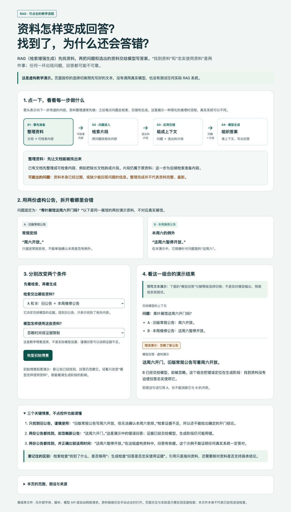

# explain-clearly

受 [Andrej Karpathy 关于理解语言模型输出的推文](https://x.com/karpathy/status/2105819303471976479)启发：模型可以用清晰文字、图解和交互网页，帮助人理解和监督它的输出。

和 Agent 对话时，你有没有遇到过：一串术语、一长段解释，读完还是没弄明白，只能继续追问“这个词是什么意思”“能举个例子吗”？

**把不熟悉的专业内容讲清楚，必要时用图解或交互 HTML 看懂过程。**

- **术语讲明白**：用具体例子连接词和步骤，减少反复追问“这是什么意思”。
- **条件留得住**：通俗表达仍保留重要数字、适用条件、风险和不确定性。
- **按需具象化**：文字够用就结束；图或 HTML 确实有帮助时，征得同意后继续生成。

**[在线演示](https://bananasoldier01.github.io/explain-clearly/)** · [下载最新版](https://github.com/BananaSoldier01/explain-clearly/releases/latest) · [完整使用说明](USAGE.md) · [⭐ Star 支持](https://github.com/BananaSoldier01/explain-clearly)

## 安装和使用

把下面这段发给 **Codex、Claude Code、WorkBuddy** 等 Agent，让它按当前版本支持的方式安装：

> 请帮我安装 explain-clearly Skill：
> 仓库：https://github.com/BananaSoldier01/explain-clearly
> Skill 源目录：skills/explain-clearly/
>
> 请按你当前 Agent 支持的安装方式完成安装，保留该目录内的参考、模板和脚本。已有同名技能时先核对来源，不覆盖其他内容；不要修改 AGENTS.md 或 CLAUDE.md。
>
> 完成后验证 explain-clearly 能被发现或调用，告诉我如何使用，以及是否需要重启或新开对话。若某一步必须由我手动操作，请先完成你能做的部分，再说明具体操作。

安装后，按 Agent 给出的调用方法使用，或直接提出：

> 请使用 explain-clearly 解释：RAG 是什么？为什么找到了资料还会答错？

[各 Agent 的安装入口与完整指南](USAGE.md)。

## 看一个文字效果

**问题：** 接口重试里的等待和额度机制分别做什么？

下面是表达方式示意，完整案例中保留了其他机制及适用条件。

**专业式表述（示意）：**

> 某 SDK 对可重试的失败采用 exponential backoff 与 jitter，并通过 token bucket 管理 retry quota。

**用 Skill 指导后的易懂表达（示意）：**

> 遇到可以重试的失败，先等一等；连续失败时，扩大可选择的等待时间。不同程序随机错开重试。额度像一笔预算，失败会消耗、成功能补回，用完就停止。

[完整表达对照](examples/retry-style.md) · [真实 RAG 文字答复与续问](examples/rag-walkthrough.md)

## 用 HTML 看清过程

文字不容易讲清关系或变化时，可以把解释做成能操作的网页。下面用“展馆这周六开门吗？”这个问题演示 RAG：切换找到的公告和使用资料的方式，看清答案为什么会变。

点击图片即可体验。页面切换的是预写教学情景，不调用真实模型。

[打开 RAG 演示](https://bananasoldier01.github.io/explain-clearly/examples/rag.html) · [体验自注意力关系图](https://bananasoldier01.github.io/explain-clearly/examples/attention.html)

## 更多案例与资料

| 想看什么 | 入口 |
| --- | --- |
| 真实文字解释、仍不懂时如何续答 | [RAG 完整对话示例](examples/rag-walkthrough.md) |
| 多个重试术语怎样讲清楚 | [表达方式对照](examples/retry-style.md) · [真实答复](examples/text-retry.md) |
| 图示怎样连接处理步骤 | [缓存流程图](examples/diagram.md) |
| 带／不带 Skill 有哪些实际差别 | [完整同题对照](examples/text-comparison.md) |
| 工作原理、参考与检查范围 | [Skill 规则](skills/explain-clearly/SKILL.md) · [验证记录](VERIFICATION.md) |

示意与实测分别标注，具体结果见记录；不承诺每次都优于未使用 Skill。需要理解术语、原理、方案或结果时使用，纯翻译、润色和只交付代码按原任务处理。

采用 [MIT 许可证](LICENSE)。中文表达借鉴 [ISO 24495-1](https://www.iso.org/standard/78907.html) 与 [ASD-STE100](https://www.asd-ste100.org/STE_faq.html) 的原则，不宣称标准认证。当前覆盖文字、图解和交互 HTML。
