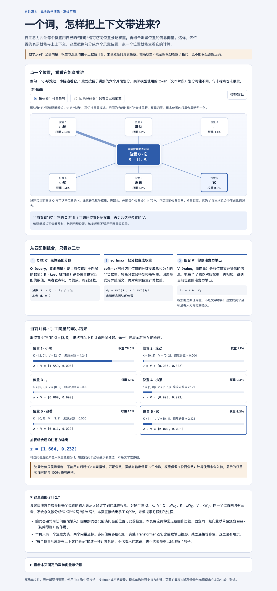

# explain-clearly

受 [Andrej Karpathy 关于理解语言模型输出的推文](https://x.com/karpathy/status/2105819303471976479)启发：随着模型承担更多执行工作，人会更需要理解和监督结果。清晰的文字、图解和交互网页，可以降低这部分理解成本。

把专业知识、术语和长篇内容，讲成相对小白能理解的话。文字不容易讲清关系或变化时，再按需用图解或交互 HTML 帮助理解。

这是一个独立 Skill：把理解读者、直接讲清楚、判断可视化价值、征得对应同意、生成并检查的流程固定下来。用户可以用普通问题开始，不必反复补充“说人话”，也不用先写完整的网页设计提示词。

**[在线演示](https://bananasoldier01.github.io/explain-clearly/)** · [下载首版](https://github.com/BananaSoldier01/explain-clearly/releases/latest) · [Skill 入口](skills/explain-clearly/SKILL.md) · [首版说明](RELEASE_NOTES.md) · [验证记录](VERIFICATION.md) · [MIT 许可](LICENSE)

## 怎么使用

实际 Skill 目录是 `skills/explain-clearly/`。按你使用的 Agent（如 Codex）的 Skills 使用说明加载这个目录；README、演示和测试不需要放进模型每次读取的上下文。文件夹存在不代表已经启用，自动发现与跨轮调用取决于具体 Agent。

支持显式 Skill 调用时，可以用 `$explain-clearly`；也可以明确要求 Agent 读取该目录中的 `SKILL.md`，然后提出普通问题，例如：

> RAG 是什么？为什么找到资料以后还会答错？

> 这个测试结果是什么意思，对我有什么影响？

> 这几个方案有什么区别，该怎么选？

默认先得到清楚的文字解释。图或网页能解决具体理解障碍时，Agent 会说明用途并征得一次同意，再继续制作。已经明确要求“画流程图”或“做交互 HTML”时，直接继续；同意画图不自动扩大为 HTML，拒绝后也不反复推荐。

## Skill 怎么工作

1. 从问题和上下文判断用户真正想理解什么，避免每次先发问卷。
2. 先回答核心问题，必要术语随文解释，用具体例子帮助理解。
3. 保留数字、条件、单位、否定、风险和不确定性，区别事实、假设、计划与已验证状态。
4. 只有可视化确实有帮助时才建议；得到对应同意后，按问题选择图示或交互方式。
5. 检查解释、图文和交互是否一致，交付时说明怎么看、怎么用。

文字规则先加载；图示和 HTML 的详细参考、模板只在需要且已获对应授权时加载。模板是可选的教学例子，模型可以根据问题自行生成其他结构。

纯翻译、润色、创作和只交付代码或 JSON 按原任务处理。混合任务只对需要解释的部分应用。

## 演示

下面直接展示纯文字回答的对比。下载文件夹后，也可用浏览器打开 `examples/index.html`，体验交互网页。页面运行不需要账号、API 密钥或外部模型服务。

| 演示 | 可以看懂什么 | 怎么体验 |
| --- | --- | --- |
| [纯文字：接口重试](examples/text-retry.md) | 退避、抖动、重试额度和幂等分别解决什么风险 | 在首页看回答片段，点链接看完整解释 |
| [纯文字：RAG 检索方案](examples/text-rag.md) | embedding、BM25、RRF、rerank 与生成怎样连接 | 在首页看回答片段，点链接看完整解释 |
| [HTML：RAG](https://bananasoldier01.github.io/explain-clearly/examples/rag.html) | 整理资料、检索、交接与生成各做什么；为什么找到资料还会答错 | 点流程步骤，再改变交出的资料和模型使用资料的方式 |
| [HTML：自注意力](https://bananasoldier01.github.io/explain-clearly/examples/attention.html) | 查询、匹配、权重与信息组合之间的关系；访问范围如何改变结果 | 点词的位置，再切换“整句”与“自己和前文” |

两份概念网页使用预写情景或手工数值，没有真实检索、模型推理或 API 调用。它们展示解释方式，不是专业模板库，也不要求所有输出采用同一布局。

### 纯文字：带与不带 Skill 的对比

下面是同一问题下两份实际回答的原句摘录。

#### 纯文字：接口重试

**问题：** 接口重试里，退避、抖动、重试额度和幂等分别防什么问题？

问题里有退避、抖动、重试额度、token bucket、幂等和 client token。使用 Skill 的回答先这样解释它们的分工：

> 它们处理的是重试中的不同风险：退避和抖动安排请求何时再发，重试额度限制还能发多少次，幂等则避免同一业务操作因重复请求而执行多遍。

其中，“重试额度”这一段的对比如下。

**不带 Skill：**

> 重试额度是给重试流量设一道上限。它用 token bucket 记录可用额度；持续失败会消耗额度，额度耗尽后客户端就停止继续重试并返回错误。这样可以避免一个持续故障被大量重试不断放大。这里的 token 是重试额度的记号。

**带 Skill：**

> **重试额度**：用一个可消耗、可恢复的预算限制重试流量。持续失败会耗尽预算，客户端便停止重试并返回错误；成功请求可以补回预算。它防的是故障期间重试越积越多、进一步加重服务压力。

**差别：** 不带 Skill 的这段仍用了 token bucket；带 Skill 的这段用“预算”解释额度，并补充了成功请求会补回额度。

#### 纯文字：RAG 检索方案

**问题：** RAG 方案里的 embedding、BM25、RRF 和 rerank 分别做什么，为什么要组合使用？

问题是一段包含 embedding、BM25、RRF 和 rerank 的 RAG 方案说明。

**不带 Skill：**

> 这段方案是在让系统先从资料库里找出与问题有关的内容，再把找到的片段交给生成模型，帮助它组织回答。RAG 可以理解为“先查资料，再根据资料作答”。

**带 Skill：**

> 这段话描述的是：先用几种方式从资料库里找出可能相关的内容，再把筛选后的片段交给生成模型，让它结合这些资料回答问题。RAG 可以理解为“先查资料，再根据查到的资料组织答案”。

**差别：** 这例两边都解释得比较清楚，差别不大。使用 Skill 后，回答继续逐个解释这些术语，例如：

> **RRF 合并**：把 BM25 和向量检索各自排出的结果合成一份候选清单。它主要参考每条结果在各自清单里的名次，不是把两种检索的原始分数直接相加。

[完整同题对照](examples/text-comparison.md) · [RAG 完整解释](examples/text-rag.md) · [接口重试完整解释](examples/text-retry.md) · [图文展示素材](examples/showcase/README.md)

### 实际生成页面的截图

下面是使用 Skill 生成的两个交互网页。点链接即可体验，截图与检查说明见[验证记录](VERIFICATION.md)。

#### HTML：RAG


看图重点：流程传递什么、检索交出哪些资料、生成阶段怎样使用它们。可以[打开 RAG HTML](https://bananasoldier01.github.io/explain-clearly/examples/rag.html)实际切换情景。

#### HTML：自注意力



看图重点：某个位置能访问谁、匹配结果怎样变成权重、权重怎样参与信息组合。可以[打开自注意力 HTML](https://bananasoldier01.github.io/explain-clearly/examples/attention.html)点词和切换访问范围。

另有 [人工编写的文字示范](examples/text.md)、[自然请求示例](examples/natural-requests.md)、[简单图示](examples/diagram.md) 和 [缓存交互例子](examples/interactive.html)。

## 文件结构

```text
skills/explain-clearly/
  SKILL.md                  触发条件与主要流程
  agents/openai.yaml        Agent 展示与调用元数据
  references/               文字、图示、HTML 的按需参考
  assets/explainer.html      可选离线教学模板
  scripts/check_html.py      可选静态检查器
examples/                   演示与示例，不是必读资源
fixtures/                   示例所用的虚构报告
tests/                      包结构、检查器与数值回归
README.md / RELEASE_NOTES.md / VERIFICATION.md / LICENSE
```

这是文件夹交付，不要求修改全局或项目的 AGENTS.md。`agents/openai.yaml` 也不是 AGENTS.md。

## 已验证范围

已做跨主题自然请求和解释流程案例检查；包结构、元数据、脚本回归通过。两份发布演示的交互来自已做浏览器检查的案例；发布整理只调整说明、来源和验证状态，没有改变交互代码。具体范围与日期见 [验证记录](VERIFICATION.md)。

模型评审和技术检查不能代替真人理解体验，也未证明具体 Agent 的自动触发、跨轮持续调用或稳定优于不带 Skill。解释仍应对照来源检查，HTML 静态检查不执行交互、不证明语义正确。

开发者可在本包目录运行：

```sh
python3 -B tests/check_package.py
python3 -B -m unittest discover -s tests -p 'test_*.py'
python3 -B skills/explain-clearly/scripts/check_html.py examples/index.html --root .
```

使用现成 Python 3.10+；数值测试还需要现成 Node.js，不自动安装。新增或改变网页交互后，要另测默认值、边界、重置、键盘、窄屏、无脚本与离线操作。

## 理念与许可

原推还提到讲解视频。本 Skill 首版覆盖文字、图解和交互 HTML，暂未纳入视频生成。

中文表达借鉴 [ISO 24495-1 的读者导向](https://www.iso.org/standard/78907.html) 与 [ASD-STE100 的清晰表达原则](https://www.asd-ste100.org/STE_faq.html)。ISO 24495-1 是国际标准；ASD-STE100 主要面向英语技术文档，这里只借鉴用词一致、直接表达和减少歧义等原则，不照搬英语词表、不宣称认证、不复制规范正文。

本项目原创的 Skill 指令、脚本、文档与演示采用 [MIT 许可证](LICENSE)。引用的论文、标准与网页仍属于各自权利人；链接和原创概念说明不改变其许可。
