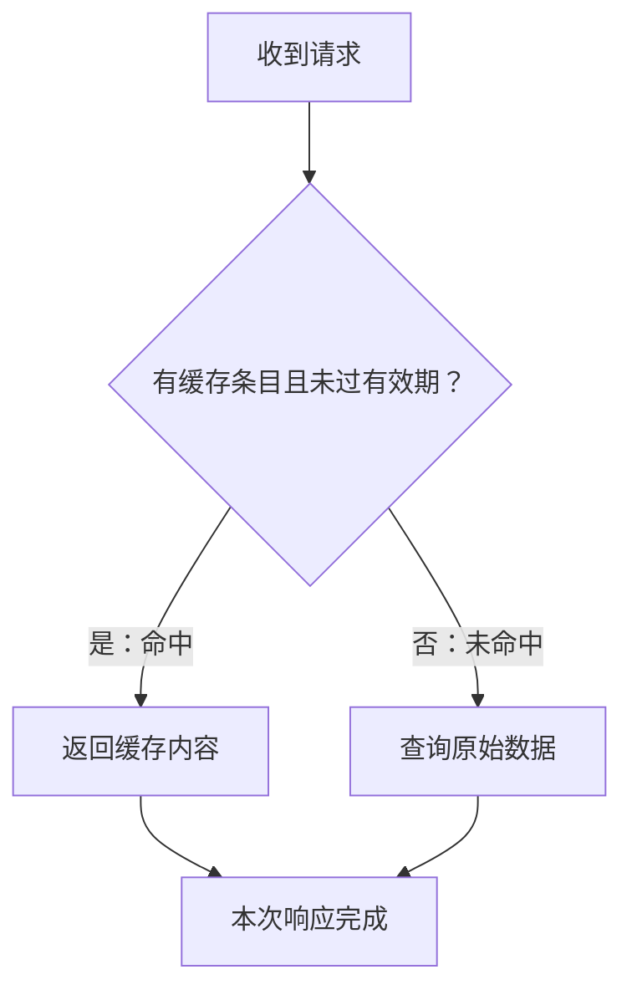

# 图示示例（用户已明确请求流程图）

用户：请用流程图解释这份报告里的缓存流程，不用交互网页。

下面的箭头表示处理的下一步，菱形表示判断；有效期和命中条件决定走哪条路径。

文字替代：收到请求后，先判断是否有未过有效期的缓存条目。有则返回缓存内容；否则查询原始数据。两条路径均完成本次响应。

依据：[虚构报告](../fixtures/source-report.md)“实现与验证状态”。本图省略报告未说明的缓存写回策略与错误处理；没有把未测试的重试画成已验证路径。该图说明流程，不证明缓存设置造成了延迟下降。Mermaid 实际显示取决于阅读工具支持。
